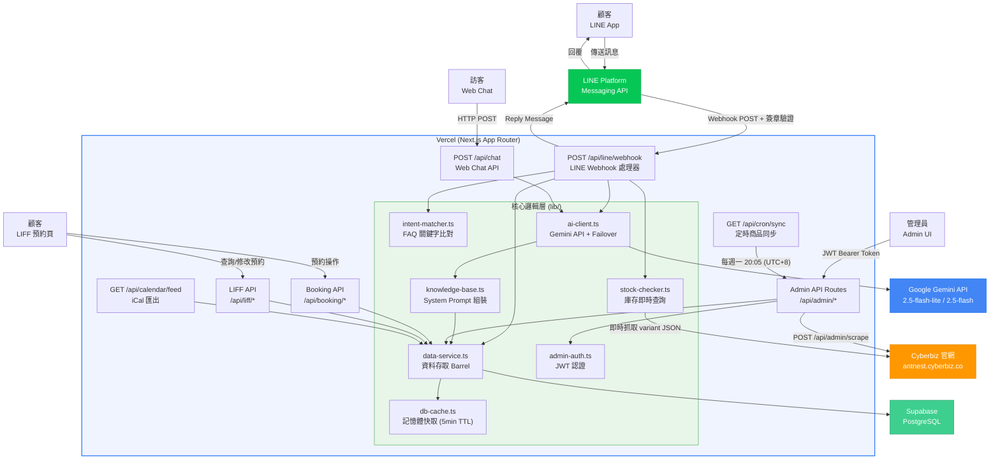
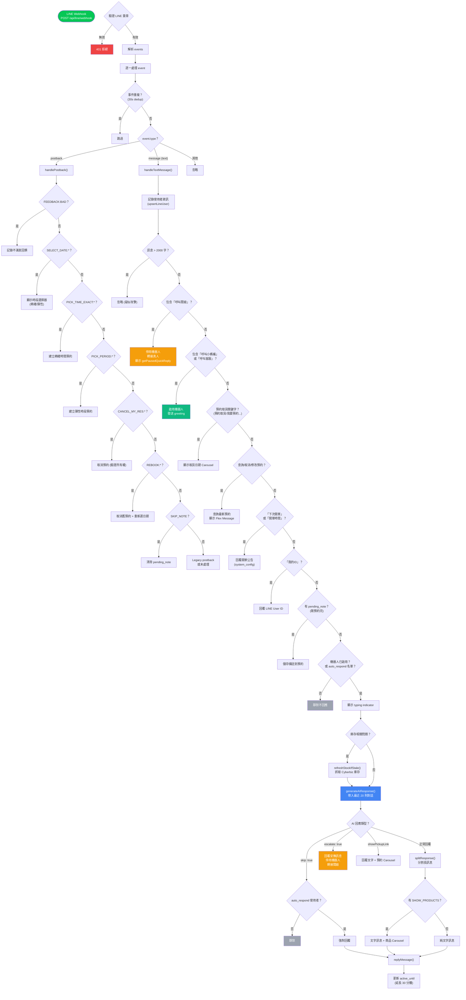
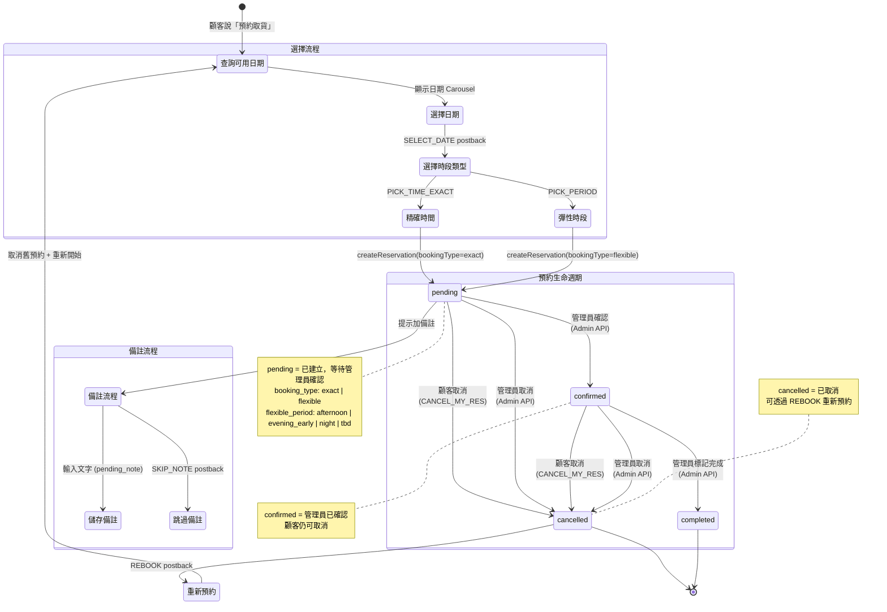
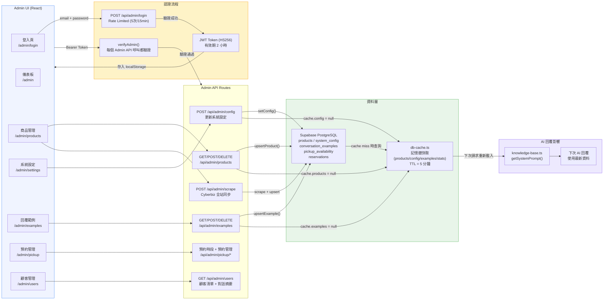
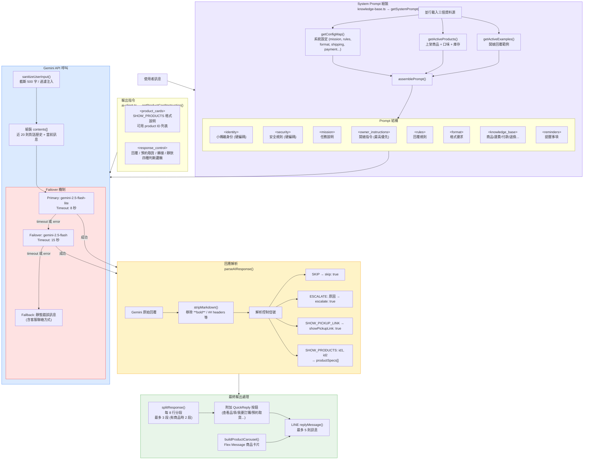

# 螞蟻窩甜點聊天機器人 -- 系統架構文件

> 本文件以 Mermaid 圖表呈現系統各層級的架構與流程，供開發與維運參考。

---

## 1. 系統架構總覽

外部使用者透過 LINE 或 Web 介面發送訊息，經 Next.js API Routes 處理後，
由意圖比對器 (Intent Matcher) 或 AI 客戶端 (Gemini) 產生回覆。
管理員透過 Admin UI 管理商品、設定與預約；Vercel Cron 定期觸發 Cyberbiz 商品同步。

---

## 2. 訊息路由流程 (Message Routing)

LINE Webhook 收到訊息後的完整決策樹。
這是系統最核心的邏輯，對應 `app/api/line/webhook/route.ts`。

---

## 3. 預約取貨狀態機 (Reservation State Machine)

預約從建立到完成的狀態轉換，包含顧客與管理員各自可執行的操作。
對應 `lib/db-reservations.ts` 中的 `Reservation.status` 欄位。

---

## 4. 管理員資料流 (Admin Data Flow)

管理員透過 Admin UI 操作資料的完整流程，包含認證、快取失效、
以及資料如何影響下一次 AI 回覆。

**快取失效機制說明：**

| 操作                                  | 失效的快取 Key   | 觸發方式                       |
| ------------------------------------- | ---------------- | ------------------------------ |
| `setConfig()` / `deleteConfig()`      | `cache.config`   | 設為 `null`，下次讀取重新查 DB |
| `upsertProduct()` / `deleteProduct()` | `cache.products` | 設為 `null`                    |
| `upsertExample()` / `deleteExample()` | `cache.examples` | 設為 `null`                    |
| `invalidateAllCaches()`               | 全部 key         | 遍歷所有 key 設為 `null`       |

快取 TTL 為 5 分鐘 (`CACHE_TTL = 5 * 60 * 1000`)。寫入操作會立即清除對應快取，
確保下一次 AI 回覆使用最新的設定與商品資料。

---

## 5. AI 回覆管線 (AI Response Pipeline)

從使用者訊息到最終回覆的完整 AI 處理流程，包含 system prompt 組裝、
模型呼叫、failover 機制、與回應解析。

**AI 模型選擇邏輯：**

| 優先順序 | 來源                     | 說明                                 |
| -------- | ------------------------ | ------------------------------------ |
| 1        | `system_config.ai_model` | 管理員在後台設定的模型               |
| 2        | `DEFAULT_MODEL`          | `gemini-2.5-flash-lite` (預設)       |
| 3        | `FAILOVER_MODEL`         | `gemini-2.5-flash` (failover 時使用) |

**回應控制信號：**

| 信號                 | 觸發條件        | 系統行為                       |
| -------------------- | --------------- | ------------------------------ |
| `SKIP`               | AI 判定不需回覆 | 靜默 (auto_respond 使用者除外) |
| `ESCALATE: 原因`     | 需要真人處理    | 安撫訊息 + 停用機器人          |
| `SHOW_PICKUP_LINK`   | 顧客想預約取貨  | 文字 + 日期選擇 Carousel       |
| `SHOW_PRODUCTS: ids` | 提及具體商品    | 文字 + 商品卡片 Carousel       |

---

## 附錄：API Routes 總覽

| Route                            | Method          | 認證        | 用途                 |
| -------------------------------- | --------------- | ----------- | -------------------- |
| `/api/line/webhook`              | POST            | LINE 簽章   | LINE 訊息進入點      |
| `/api/chat`                      | POST            | 無          | Web Chat API         |
| `/api/admin/login`               | POST            | Rate Limit  | 管理員登入，發放 JWT |
| `/api/admin/config`              | GET/POST        | JWT         | 系統設定 CRUD        |
| `/api/admin/products`            | GET/POST/DELETE | JWT         | 商品 CRUD            |
| `/api/admin/scrape`              | POST/PUT        | JWT         | Cyberbiz 商品同步    |
| `/api/admin/examples`            | GET/POST/DELETE | JWT         | 回覆範例 CRUD        |
| `/api/admin/pickup/availability` | GET/POST/DELETE | JWT         | 取貨時段管理         |
| `/api/admin/pickup/reservations` | GET/PATCH       | JWT         | 預約管理             |
| `/api/admin/pickup/slots`        | GET             | JWT         | 時段查詢             |
| `/api/admin/users`               | GET             | JWT         | 顧客清單 + 對話摘要  |
| `/api/booking/slots`             | GET             | 無          | LIFF 取貨時段查詢    |
| `/api/booking/reserve`           | POST            | 無          | LIFF 建立預約        |
| `/api/liff/reservations`         | GET/PATCH       | lineUserId  | LIFF 預約查詢/修改   |
| `/api/cron/sync`                 | GET             | CRON_SECRET | Vercel Cron 商品同步 |
| `/api/calendar/feed`             | GET             | 無          | iCal 格式預約匯出    |
